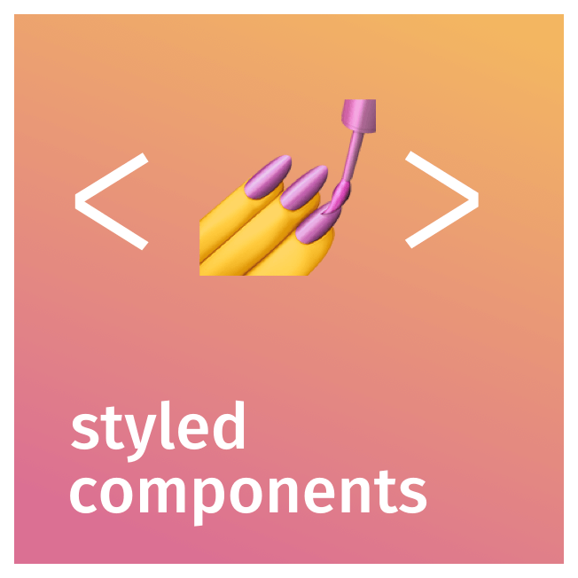
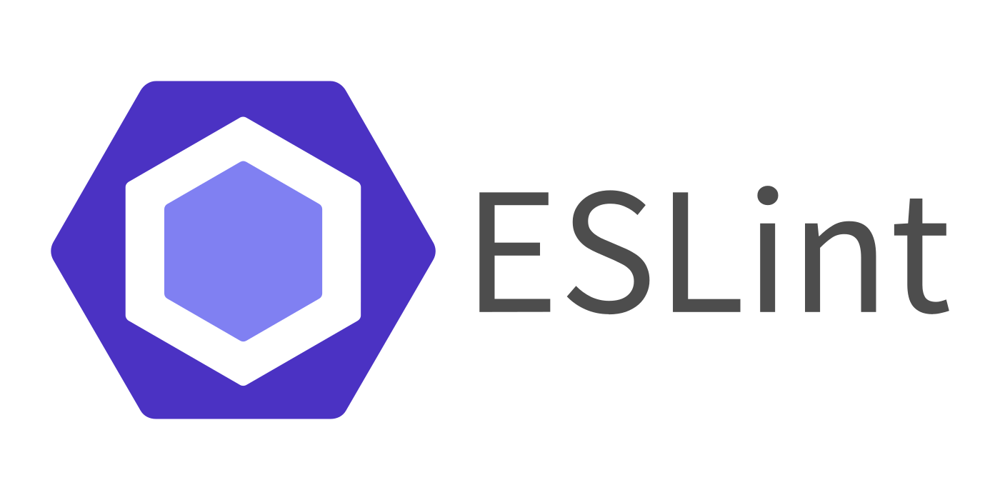
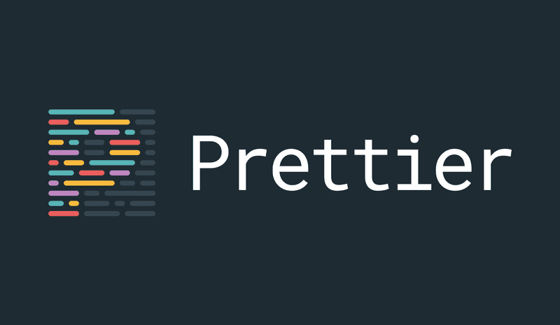

<h1>
  <strong>Next Starter +</strong>&nbsp;
  &nbsp;&nbsp;
  &nbsp;&nbsp;
  &nbsp;&nbsp;
  
</h1>

## ⚡️ Quick Start

[](https://vercel.com/new/project?template=https://github.com/roavellarm/next-starter)

## 🚀 Getting Started

Run the following command to create a new project with this Starter:

```
yarn create next-app my-app -e https://github.com/roavellarm/next-starter
```

Once the project and dependencies are finished installing, you can navigate to
that directory and start up the development server with:

```
yarn dev
```

Open [http://localhost:3000](http://localhost:3000) with your browser to see your new project!

## 🧐 What's inside?

This Starter includes:

- [Typescript](https://www.typescriptlang.org/)
- [Styled Components](https://styled-components.com/)
- [Eslint](https://eslint.org/)
- [Prettier](https://prettier.io/)

## 📚 Learn More About Next.js

To learn more about Next.js, take a look at the following resources:

- [Next.js Documentation](https://nextjs.org/docs) - learn about Next.js features and API.
- [Learn Next.js](https://nextjs.org/learn) - an interactive Next.js tutorial.

You can check out [the Next.js GitHub repository](https://github.com/vercel/next.js/) - your feedback and contributions are welcome!
